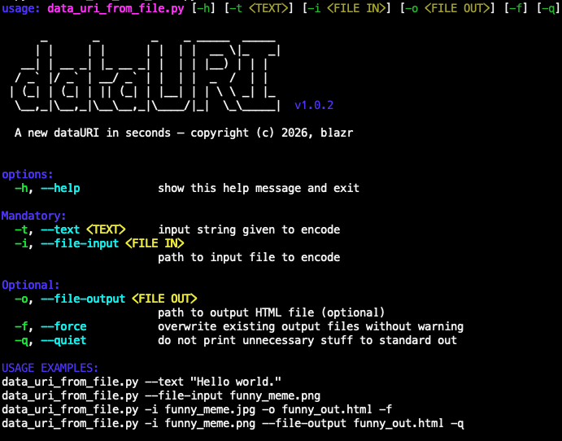

# dataURI
Convert any kind of data (images, files, etc.) to a data-URI/URL.

## What is a data-URI?

If you ever were in need of a [data-URI](https://developer.mozilla.org/en-US/docs/Web/URI/Reference/Schemes/data) you know that it is a bit annoying to create. Mostly people resort to using internet services/websites for this. But you can locally do this easily if you have Python.

```
<a href="data:text/html;charset=utf-8;base64,YWxlcnQoJ0hlbGxvIFdvcmxkIScpOw==">Click me</a>
```
**Example Data-URI:** <a href="data:text/html;charset=utf-8;base64,YWxlcnQoJ0hlbGxvIFdvcmxkIScpOw==">Click me</a>

## Why and when do I use it?

If you want an HTML document to be delivered in one go, you can encode all additional content which usually refers to a file as a data-URI instead and embed this content directly into the HTML document.

**Advantages:**

* only one HTTP-request is necessary to deliver the document
* document is complete, no other files need to be requested or delivered
* delivery is faster because the webserver only needs one request and response
* very helpful for low power webservers like on microcontrollers


## Installation

Create a virtual environment and activate it, then install the `python-datauri` module.

```bash
python3 -m venv venv
source venv/bin/activate
pip install python-datauri
```

## Usage

```bash
python data_uri_from_file.py -h
```



## Convert to HTML
To convert a file into a URI that you can preview and see in a custom html file just call following.

```bash
python data_uri_from_file.py -i data_uri_from_file.py -o my_data_uri.html
```

## Convert to data directly
To convert and directly copy to the pasteboard (on macOS) just call the following using `pbcopy` tool.

```bash
python data_uri_from_file.py -i data_uri_from_file.py -q | pbcopy
```

